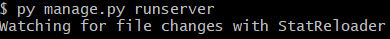
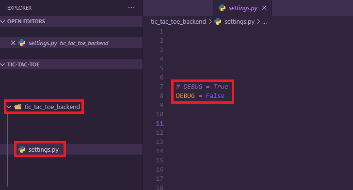

# TicTacToe Backend by Hrvoje Škrbina

## Table of Contents
  - [Introduction](#introduction)
  - [Installation](#installation)
  - [Local usage](#local-usage)
  - [Usage](#usage)

---
## Introduction
A server made as a part of the practice final project at Atos Convergence Creators d.o.o. entirely made using Python's Django framework and REST API. Handles primarily JSON and is used to communicate with the front-end.

---
## Installation
1. Set up virtual environment
    - `python -m venv env`
    - `env` is the name, feel free to change it
2. Activate virtual environment
    - `source env/Scripts/activate`
3. Use the package manager [pip](https://pip.pypa.io/en/stable/) to install requirements.
    - Required
        - `pip install -r requirements.txt`
    - Optional
        - `python -m pip install --upgrade pip`
4. Make migrations and migrate changes (***in order!***)
    - `python manage.py makemigrations`
    - `python manage.py migrate`
5. Run the server
    - `python manage.py runserver`
    - should look like this in the console
        - 

Now, the server is running. Locally, server is accessible on: `localhost:8000`


---
## Local usage

### In order to use server locally, changes to settings need to be made.



1. Open `tic_tac_toe_backend` folder
2. Open `settings.py`
3. Change `DEBUG` to `True`

---
## Usage
### *Request*: **POST** `/games`
  1. Posting single game
```json
{
    "player1": "playerName",
    "player2": "playerName",
    "moves": [
        {
            "move_number": 0,
            "affected_field": 0
        },
        ...additional moves
    ],
    "winner": "playerName"
}
```
  2. Posting multiple games (***have to be posted as a list of JSON objects***)
```json
[
	{
		"player1": "playerName",
		"player2": "playerName",
		"moves": [
			{
				"move_number": 0,
				"affected_field": 0
			},
            ...additional moves
		],
		"winner": "playerName"
	},
	{
		"player1": "playerName",
		"player2": "playerName",
		"moves": [
			{
				"move_number": 0,
				"affected_field": 0
			},
            ...additional moves
		],
		"winner": "playerName"
	},
    ...additional games
]
```
### *Responses*:
  - 201 (Created)
    - returns given query
  - 400 (Bad Request)

---
### *Request*: **GET** `/games`
  - Returns list of JSON objects of all games
```json
[
    {
        "id": 1,
        "moves": [
            {
                "move_number": 1,
                "affected_field": 0
            },
            {
                "move_number": 2,
                "affected_field": 5
            },
            {
                "move_number": 3,
                "affected_field": 5
            },
            {
                "move_number": 4,
                "affected_field": 7
            },
            {
                "move_number": 5,
                "affected_field": 7
            },
            {
                "move_number": 6,
                "affected_field": 6
            },
            {
                "move_number": 7,
                "affected_field": 6
            },
            {
                "move_number": 8,
                "affected_field": 2
            },
            {
                "move_number": 9,
                "affected_field": 2
            }
        ],
        "player1": "playerName",
        "player2": "playerName",
        "winner": "playerName"
    },
    ...additional games
]
```

### *Request*: **GET** `/games/<int>`
  - returns game with specific ID
  - returns ONE JSON object

### *Request*: **GET** `/games/<str>`
  - returns all games from specific user / player
  - returns one OR multiple JSON objects

## *Responses*:
  - 200 (OK)
  - 204 (No Content)
---
### *Request*: **DELETE** `/games`
  - deletes all games in the database (purge)


### *Request*: **DELETE** `/games/<int>`
  - deletes game with specific ID

### *Request*: **DELETE** `/games/<str>`
  - deletes all games from specific user / player

### *Responses*:
  - 200 (OK)
  - 204 (No Content)